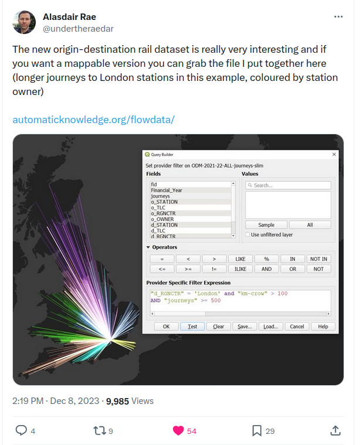

# Passenger Journeys: Pictures at a (Rail Transport) Exhibition[^1]

This blog is about using the Office of Road and Rail (ORR) financial year 2021/22 [passenger travel data](https://raildata.org.uk/dataProduct/P-a9faf6fd-b31f-491c-935a-f4ab3ffa5890/overview) projected onto a shortest-path network using the [centre-line track-model](https://github.com/openraildata/network-rail-gis) this [project](https://github.com/anisotropi4/kingfisher) looks to create visualisation for passenger journey numbers for the active rail stations across the British rail network.

It sets out the backgroud is to this post on and how it seemed to get a bit daft. I'm not sure if it went viral, at just shy of 500k page impression on X, and 15k on LinkedIn in under a week, maybe more bacterial?

 

## Background
During the Merrineum, in the dog days between the feast of St Stephen and the New Year, I often find myself on holiday and at a lose-end. I like a short data project, and in previous years I have had a go at taking the National Electronic Sectional Appendix (NESA) loading-gauge tables for freight from PDF and converting them into a [spreadsheet](https://github.com/anisotropi4/nesa) or converting 30GB of MicroSoft inferred road location data. I can't share a link to this as it blew my GitHub limit. I am a physicist by training, so let me tell you about this [spherical cow](https://en.wikipedia.org/wiki/Spherical_cow).

While I work in IT[^2] *this has nothing to do with my day job*[^3], only about seeing what I could do with OpenData. While work gives me familiarity with the rail data landscape and some of the challenges here, it is nothing more. 

## The Big-Boys Made Me Do It
Over that last few years this has been often inspired by an Alisdair Rae's posts, and this year it was this

I have been looking at open-data for a while now, where a key event for me would with Stuart Lowe's 2017 [Garth map](https://open-innovations.org/blog/2017-04-12-garth-map). Over the last few years I have followed this up with on-line talks about rail and open-data at the Leeds and Sheffield DigiFests[^4] and seminars to post-graduates about data-visualization and data-science.

I'd also been looking at Peter Hicks' Freedom of Information data release of the national rail [centre-line track-model](https://github.com/openraildata/network-rail-gis), scraping the rail data from [Open Street Map](https://github.com/anisotropi4/magpie), and having a look at trying to overlay the [two-network models](https://github.com/anisotropi4/woodpecker).

### Distances
While I had heard the financial year 2021/22 origin-destination matrix passenger data were available on the [Rail Data Market place](https://raildata.org.uk/), it involves registering, providing details of your organisation *almost to the point of providing inside leg measurements* and having a manual approval process, I hadn't quite got round to it.

From Alisdair's post [X/Twitter post](https://fxtwitter.com/undertheraedar/status/1733129178092806475), he'd included **as-the-crow-flies** distances between railway station locations, and had also hosted it [here](https://automaticknowledge.org/flowdata/). My rather obvious thought was to extend this model to use the centre-line track-model to approximate the shortest-path distance between stations. I'd got the ORR passenger-flow data, and the FoI centre-line track-model, so how hard could it be?

### Wrinkles and Data Wrangling
If you have ever done this before, there is always a wrinkle. In this case there were several. Using python and a whole bunch of cool modules, wrangling involved all of the following

1. Add station point locations as the [ODM dataset](https://automaticknowledge.org/flowdata/) has LineStrings but not Point geometry
2. Look up the locations in the National Public Transport Access Network gazette ([NaPTAN](https://data.gov.uk/dataset/3b1766bf-04a3-44f5-bea9-5c74cf002e1d/national-public-transport-gazetteer-nptg))
3. As NaPTAN has Timing Point LOCations (TIPLOC) codes not CRS, use the Network Rail OpenRailData CORPUS data to match CRS to TIPLOC
    * As six TIPLOCs matches are wrong, hack these
    * For the four CRS locations missing from NaPTAN, use OpenStreetMap to find these
4. Simplify the [centre-line track-model](https://github.com/openraildata/network-rail-gis) to remove simple connected links
5. Snap the station locations to track on the network model
6. Split the network-model line-segments at snapped station locations

The scripts are on the GitHub [kingfisher](https://github.com/anisotropi4/kingfisher/) repository if you want look at this and run this yourself.

### Distances Part Deux
Having got a network model and a locations each of the stations, you get the distances by grinding through the shortest paths for each pair of stations. Assuming a shortest-distance algorithm is appropriate here, this tells you things like
* To travel between Wick and St Ives is a journey of 1478.23km
* a brave soul travelled between Wick and Bodmin Parkway, a mere 1396.26km
* You would want to walk between 
  * Southend Central and Southend Victoria
  * Dorking Deepdene and Dorking
* There are bunch of zero-distance journey buried here

For the rest of this work zero-distance locations were ignored.

### Go With The Flow
Where you have a property associated with each of the flows, in this case annual passenger journeys, once you have a network model with identified paths between locations, you can start to do something interesting. My thought was to take all the track segments, sum across all locations and see what you get. Which is what I did [here](https://fxtwitter.com/WillDeakin1/status/1741850764790596048).

[^5]

Which was about 15:55 on 1 January 2024. These were hand-cranked in [QGIS](https://www.qgis.org/) and look cool. They have clocked up 32k views in under a week which, for me, is big engagement numbers. But I had to generate a `GeoPKG` file for each station I thought, why not do something scripted, like [`matplotlib`](https://matplotlib.org/) and generate a PNG image file for the data. A bit more scripting to generate the images and a Markdown reference file was done, and the following evening at 19:09 I put up the 2,567 images [post](https://fxtwitter.com/WillDeakin1/status/1742261940800401576).

## What Did People Think?
Alisdair spotted my post and was kind enough to repost [here](https://fxtwitter.com/undertheraedar/status/1742273707177853391) with some nice words and picked out some cool selections of images, and it kind of took off.

 

There were some issues in with the first 24-hours. I had made two really stupid mistakes

### UX is important
+ I had gone with two-columns which meant *many people on phones couldn't see the second column* and **wanted to know where their station was**

The original Markdown was a four-column table. But I though I would check and asked around. Peter Hicks suggested on column but I convinced him that two was ok. Oy vey!

### Hosting Gremlins
+ I planned to push the 16GB of data as well as the image files, I had set up the images as GitHub Large File Storage (LFS)

However, GitHub there is both as file-size limit for LFS and a *bandwidth limit of 1GB per calendar month*. While I was at work on Wednesday, I got a two emails from GitHub, which I missed. The first at 12:47 that I'd blown my 1.0GB bandwith and a takedown at 13:36. In the 18.5 hours it'd eaten 1.5GB after the post gone up. Oddly the normal GitHub filestore is metered on a fair-usage policy, and as the interest has dropped so has the bandwith[^6].

### The Isle of Wight
The stations on the Isle of Wight are an issue if you are trying to use the centre-line track-model. As part of the data analysis I knew of at least two disconnetected clusters, the mainland and stations on the Isle of Wight. Which made sense as there isn't a piece of track in the network and with passenger numbers. But, as with the zero-distance data, I chose to ignore these.

The tao of having a lot of folk look at your visualisation is that errors get spotted. As I really don't know this part of the UK well I asked and was giventhe sensible suggestion for a route between Ryde Pier Head to Portsmouth Harbour staions. I patched this using the Open Street Map ferry link plus some extra to complete the network. It is there now.

## Reflections and Impact
For me this has been a lot of fun but also scary, but hope some good has come out of this. There has been some excellent discussion about what it all means, some kind words, and the opportunity to write this blog.

On Thursday morning Alisdair sent me this kind note, which I share here[^7]

1. 90% amazing, wow, love it - unreal piece of work 
2. 5% MY StATiON isNT ListED 
3. 3% It's all fake, this guy doesn't know anything about trains 
4. 2% Have you considered x, y, z approach that actually isn't possible anyway?

Which is scarily accurate. I pulled some data together, in a conceptually simple way, albeit with an overly complex implementation, and drew some pictures. What is then interesting is that this showed something that wasn't immediate obvious by just looking at the data in a way that seemed to resonate with people.

I have also been asked to be very clear about the data attribution, and I think this shows the power of open-data. It also looks like these images may make it onto Wikipedia, which is even better. The power of the free.

It is also repeatable, in all of my stuff I attempt to write it up and for those interested in such things put in on GitHub or whereever and make it shareable and repeatable for others to use.

Out of this I have had a lot more para-social interactions in such as short period of time than ever before. I have also had people who I know and who are good at this show an interested in this, which is cool. (Which is for me where the anxiety comes in, being made to look like an arse in front of your peers). Also some folk who were mildly annoying, it's social media, who knew?

Overall it's kept me amused me for a about a week now, I'm sure it'll never happen again like this, but shows what is possible when you pull on the strands and see what you've got. Until next year.

### Coda
My final thoughts are, this is far too long, and a ramble. I also only expect to ever be asked to do this once so this is my 18 minute long 12" single-remix. Also why is the railway so complicated?

## Data
All data used on the basis that it under open or permissive license

1. The base map of mainland Britain is derived from the [WorldPop](https://hub.worldpop.org) base maps under [CC 4.0 by deed](https://creativecommons.org/licenses/by/4.0/) retrieved 2023-09-07.
2. The centre-line track-model is hosted by [OpenRailData](https://github.com/openraildata/network-rail-gis) under the [Open Government License](https://www.nationalarchives.gov.uk/doc/open-government-licence/version/3/) by Network Rail retrieved 2023-07-11.
3. The Origin Destination Matrix data was published by the Office of Road and Rail on the Rail Development Group Rail Data Market place, details [here](https://raildata.org.uk/partnerDetails/1034/details) under the [Open Government License](https://www.nationalarchives.gov.uk/doc/open-government-licence/version/3/). With a variant retrieved from [AutomaticKnowledge](https://automaticknowledge.org/flowdata/) dated 2023-12-06.
4. The Network Rail CORPUS dataset is an open data feed which is released under a [OGL](https://networkrail.co.uk/who-we-are/transparency-and-ethics/transparency/open-data-feeds/network-rail-infrastructure-limited-data-feeds-licence/) retrieved 2023-11-29.
5. The National Public Transport Access Network gazette [NaPTAN](https://data.gov.uk/dataset/3b1766bf-04a3-44f5-bea9-5c74cf002e1d/national-public-transport-gazetteer-nptg) under [OGL](https://www.nationalarchives.gov.uk/doc/open-government-licence/version/3/), and is updated each time the scripts are run.
6. OpenStreetMap data is then used to validate and also to identify 10 stations locations which is licensed under [CC-BY-SA 2.0](https://openstreetmap.org/copyright ) through the [OverPassAPI Turbo](https://overpass-turbo.eu/) service, and is updated each time the scripts are run.

## Notes

[^1]: I was going to call this blog:

    "She's got the radioactive  
    And it makes me feel okay  
    I don't feel OK"

    From the Pavement song "Perfume-V" on the album "Slanted and Enchanted". 
    It is a sign of how much I've grown since 1992 years that I didn't.

[^2]: Twitter Bio:
    I do governance for British railway IT plus European regulation
    I believe data makes rail passengers lives better. 
    
    Ask me how!
    
    #Physicist #OpenData #DataScience
    
[^3]: LinkedIn:
    For what it's worth, my [day job](https://www.linkedin.com/in/will-deakin-538729/) is in the assurance and delivery of all Network Rail IT projects related to national timetable planning, operations and performance systems and interfaces. 

[^4]: YouTube Channel:
    Yes, this really is my "Here is my SoundCloud" moment. I've recorded the talks and posted them on you tube [here](https://www.youtube.com/channel/UCfdm5ljpPEQOoKWNEvibZKQ)
    
[^5]: Legendary Issues:
    Yes, I spelt "Pasenger" wrong, and the legend on the second diagram is wrong. The legend is log and the colour scale is linear. A corrected copy is available by correspondence.

[^6]: Hosting:
    Given the level of interest, and in anticipation of the next years data, I am in discussions about providing stable hosting elsewhere. I just need to find a way to also host the raw data and not just the image files.

[^7] With his permission:
    I did ask.
